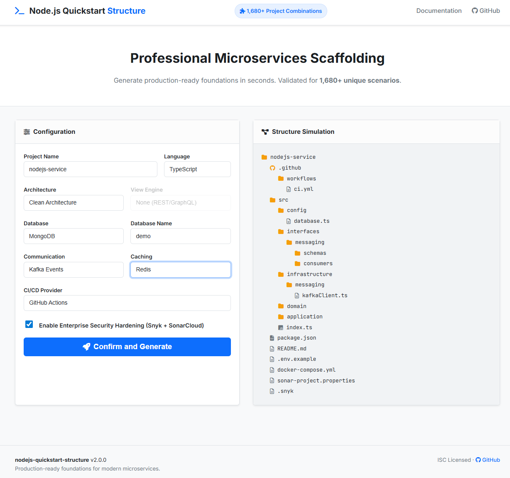

# Node.js Quickstart Generator

[](https://www.npmjs.com/package/nodejs-quickstart-structure)
[](https://www.npmjs.com/package/nodejs-quickstart-structure)
[](https://www.npmjs.com/package/nodejs-quickstart-structure)
[](https://opensource.org/licenses/ISC)

### 📈 Real-world Adoption
| **Metric** | **Insight** |
| :--- | :--- |
| 🔥 **4,000+** | Downloads on npm |
| 🚀 **1,200+** | Recent GitHub Clones |
| 🌍 **Trusted by** | Devs from **Google**, **Viblo**, and global tech teams |

---

A powerful ecosystem to scaffold production-ready Node.js microservices with built-in best practices. Choose between **MVC** or **Clean Architecture**, **JavaScript** or **TypeScript**, and your preferred tech stack in seconds.

## 📌 Table of Contents

- [🚀 Quick Start](#-choose-your-journey)
- [🆕 What's New](#-whats-new-in-v21-the-authentication-release)
- [✨ Key Features](#-key-features)
- [🛡️ Professional Standards](#-professional-standards)
- [🧩 5,280+ Project Combinations](#-5280-project-combinations)
- [⚙️ Configuration Options](#-configuration-options)
- [🏗️ Generated Project Structure](#-generated-project-structure)
- [📖 Documentation](#-documentation)
- [🗺️ Support & Roadmap](#️-roadmap--support)

## 🚀 Choose Your Journey
 
| **Path A: Next-Gen Web UI** (Recommended ⭐️) | **Path B: Interactive CLI** |
| :--- | :--- |
| <a href="https://paudang.github.io/nodejs-quickstart-structure/#configurator"></a> |  |
| [Try Visual Configurator →](https://paudang.github.io/nodejs-quickstart-structure/#configurator) | [See CLI Commands ↓](#-path-b-interactive-cli) |
| ✨ **Visual Preview**: Real-time folder simulation. | ⚡ **Fast & Direct**: Quickly scaffold in terminal. |
| 🛠️ **Zero-Prompt**: Paste a tailored command. | 🦾 **AI-Ready**: Generates `.cursorrules`. |

---

### 🦾 Path B: Interactive CLI
**Scaffold your project directly from your terminal in seconds.**

```bash
npx nodejs-quickstart-structure@latest init
```

*Or install globally:*
```bash
npm install -g nodejs-quickstart-structure
# Then run:
nodejs-quickstart init
```

---

## 🆕 What's New in v2.1 (The Authentication Release)
 
 The v2.1.0 release is a major leap forward, turning the generator into a **Community Standard**:
 
- **🔐 Pluggable JWT Authentication**: Production-ready access & refresh token patterns with automatic PM2/Environment configuration.
- **🦾 AI-Native Foundation**: Built-in `.cursorrules` optimized for **Cursor** & AI agents—projects are "Born to be Autonomously Coded."
- **🖼️ Next-Gen Web UI**: A browser-based visual project simulator with real-time folder previews.
- **🏗️ Enterprise Clean Architecture**: High-fidelity structure for professional Microservices (TS/JS).
- **🛡️ Hardened Security**: Integrated Snyk & SonarCloud logic in core templates.
- **⚡ Zero-Prompt Workflow**: Generate projects with a single CLI command.

---


## ✨ Key Features

- **Interactive CLI**: Smooth, guided configuration process.
- **Multiple Architectures**: Supports both **MVC** and **Clean Architecture**.
- **Modern Languages**: Choice of **JavaScript** or **TypeScript**.
- **Database Ready**: Pre-configured for **MySQL**, **PostgreSQL**, or **MongoDB**.
- **Communication Patterns**: Supports **REST**, **GraphQL** (Apollo), and **Kafka** (Event-driven).
- **Multi-layer Caching**: Integrated **Redis** or built-in **Memory Cache**.
- **Pluggable Authentication**: Built-in **JWT** support (Refresh/Access tokens).
- **AI-Native Optimized**: specifically designed for **Cursor** and AI agents, including built-in `.cursorrules` and Agent Skill prompts. 🚀

---

## 🛡️ Professional Standards

We don't just generate boilerplate; we generate **production-ready** foundations. Every project includes:

- **🔍 Code Quality**: Pre-configured `Eslint` and `Prettier`.
- **🛡️ Enterprise Security**: Integrated **Snyk (SCA)**, **SonarCloud (SAST)**, `Helmet`, `HPP`, and Rate-Limiting.
- **🚨 Robust Error Handling**: Centralized global error middleware with custom error classes (`ApiError`, `NotFoundError`, etc.) — consistent across REST & GraphQL.
- **🧪 Testing Excellence**: Integrated `Jest` and `Supertest` with **>80% Unit Test coverage** out of the box.
- **🔄 DevOps & CI/CD**: Optimized **Multi-Stage Dockerfiles**, health checks, infrastructure retry logic, and workflows for **GitHub Actions**, **Jenkins**, **GitLab CI**, **CircleCI**, and **Bitbucket Pipelines**.
- **🚀 Scalable Deployment**: Integrated **PM2 Ecosystem** config for zero-downtime reloads.

---

## 🧩 5,280+ Project Combinations

The CLI supports a massive number of configurations to fit your exact needs:

- **480 Core Combinations**:
  - **MVC Architecture**: 360 variants (Languages × View Engines × Databases × Communication Patterns × Caching × Auth)
  - **Clean Architecture**: 120 variants (Languages × Databases × Communication Patterns × Caching × Auth)
- **5,280+ Total Scenarios**:
  - Every combination can be generated across 5 CI/CD providers.
  - Optional **Enterprise-Grade Security Hardening** doubles the scenarios.
  - Every single scenario is verified to be compatible with our **80% Coverage Threshold** policy.

---

## ⚙️ Configuration Options

The CLI will guide you through:
1. **Project Name**
2. **Language**: `JavaScript` | `TypeScript`
3. **Architecture**: `MVC` | `Clean Architecture`
4. **View Engine**: (MVC only) `None` | `EJS` | `Pug`
5. **Database**: `MySQL` | `PostgreSQL` | `MongoDB`
6. **Communication**: `REST` | `GraphQL` | `Kafka`
7. **Caching**: `None` | `Redis` | `Memory Cache`
8. **Auth**: `None` | `JWT`
9. **CI/CD**: `GitHub Actions` | `Jenkins` | `GitLab CI` | `CircleCI` | `Bitbucket Pipelines`
10. **Security**: (Optional) Snyk & SonarCloud Hardening

---

## 🏗️ Generated Project Structure
Depending on your choices, the structure adapts. Here is a **TypeScript + Clean Architecture** preview:

```text
.
├── src/
│   ├── application/     # Use cases & Business logic
│   ├── domain/          # Entities & Repository interfaces
│   ├── infrastructure/  # DB, External services, Repositories
│   ├── interfaces/      # Controllers, Routes, GraphQL, Kafka
│   ├── errors/          # Custom Error Classes
│   ├── config/          # Environment & Global settings
│   └── index.ts         # Server entry point
├── flyway/sql/          # SQL migrations (if applicable)
├── docker-compose.yml   # Infrastructure services
├── package.json         # Scripts and dependencies
├── .cursorrules         # AI assistance rules (The "AI Brain")
└── .env.example         # Environment template
```

---

## 📖 Documentation

For full guides, architecture deep-dives, and feature references, visit our **[Official Documentation Site](https://paudang.github.io/nodejs-quickstart-structure/guide/getting-started.html)**.

---

## ❤️ Support & 🗺️ Roadmap

### Support the Project
If this tool helped you build your project faster, please support us:
- Give us a ⭐ on [GitHub](https://github.com/paudang/nodejs-quickstart-structure) to help us reach our next milestone!
- Read our [Medium Series](https://medium.com/@paudang/nodejs-quickstart-generator-93c276d60e0b) for architecture deep-dives.

### Roadmap
Track our progress and vote for features on our public board:
👉 **[View our Public Roadmap on Trello](https://trello.com/b/TPTo8ylF/nodejs-quickstart-structure-product)**

---

## ⭐ Why Star us?

We are on a mission to build the best AI-Native Node.js scaffolding experience. Your star is not just a "like"—it's a vote of confidence that helps us:

1. **Attract Contributors**: More stars attract professional maintainers to keep this project secure and up-to-date.
2. **AI Model Awareness**: Popular repositories are weighted higher by AI coding assistants (Cursor, Copilot, etc.), making the generated code even better.
3. **Open Source Sustainability**: It motivates us to keep building and shipping "Enterprise-Grade" features for free.

If this tool saved you hours of work, **[please give us a Star!](https://github.com/paudang/nodejs-quickstart-structure)** 🚀

---

## License

ISC
