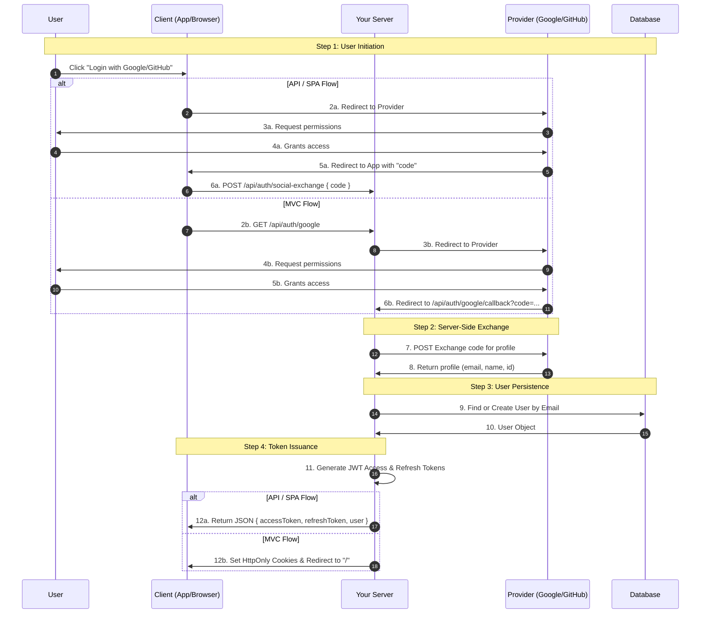

# Authentication

This blueprint provides a comprehensive guide on setting up and understanding the **enterprise-grade authentication system** scaffolded by the generator. 

Whether you're using standard email/password or Social Login (Google/GitHub), this guide covers everything from environment configuration to advanced security features like token rotation and theft detection.

---

## Configuration

Authentication is driven by environment variables in your `.env` file. 

```bash
# Core JWT Config
JWT_SECRET=your_super_secret_key          # Used to sign Access Tokens
JWT_REFRESH_SECRET=your_refresh_secret    # Used to sign Refresh Tokens
JWT_EXPIRES_IN=15m                        # Access token TTL (short-lived)
JWT_REFRESH_EXPIRES_IN=7d                 # Refresh token TTL (long-lived)

# Social Login (Optional)
GOOGLE_CLIENT_ID=your_id
GOOGLE_CLIENT_SECRET=your_secret
GOOGLE_CALLBACK_URL=http://localhost:3000/api/auth/google/callback

GITHUB_CLIENT_ID=your_id
GITHUB_CLIENT_SECRET=your_secret
GITHUB_CALLBACK_URL=http://localhost:3000/api/auth/github/callback
```

---

## Standard Auth Flow (Email/Password)

Our standard flow follows industry best practices: **Stateless Access Tokens** paired with **Persistent Refresh Tokens**.

### 1. User Registration (Signup)
Users can register by sending their name, email, and password. The system automatically hashes the password using `bcryptjs` before storage.

::: code-group
```bash [REST API]
POST /api/users
{
  "name": "Jane Doe",
  "email": "jane@example.com",
  "password": "securepassword123"
}
```

```graphql [GraphQL]
mutation {
  createUser(name: "Jane Doe", email: "jane@example.com", password: "securepassword123") {
    id
    email
  }
}
```
:::

### 2. User Login
Upon successful login, the server returns an `accessToken` and a `refreshToken`.

```bash
POST /api/auth/login
{
  "email": "jane@example.com",
  "password": "securepassword123"
}
```

**What happens next?**
- **Client-Side**: Store the `accessToken` in memory (or a secure state) and the `refreshToken` in a secure, HttpOnly cookie (default for MVC) or secure storage (API).
- **Authorization**: Include the token in subsequent requests: `Authorization: Bearer <accessToken>`.

---

## Social Login Integration

The generator supports a "Pluggable Social Auth" system that adapts to your architecture (MVC, SPA, or Mobile).

### How it Works

The generator handles the complexity of OAuth2 by providing a seamless, integrated authentication flow.


<details>
<summary>View Technical Sequence Diagram (Advanced)</summary>



</details>

### Provider Setup Guides

| Provider | Setup Location | Required Redirect URI |
| :--- | :--- | :--- |
| **Google** | [Google Cloud Console](https://console.cloud.google.com/) | `http://localhost:3000/api/auth/google/callback` |
| **GitHub** | [GitHub Developer Settings](https://github.com/settings/developers) | `http://localhost:3000/api/auth/github/callback` |

> [!IMPORTANT]
> For **MVC** architectures, the server handles the redirects automatically. For **API/GraphQL** architectures, the client (React/Vue/Mobile) should handle the initial redirect and send the `code` to the server.

---

## Advanced Security Features

Our implementation includes "Big Tech" security features out of the box.

### 1. Refresh Token Rotation
Every time a `refreshToken` is used to get a new `accessToken`, the old `refreshToken` is invalidated and a **brand new one** is issued. This minimizes the window of opportunity for an attacker.

### 2. Theft Detection
If a leaked `refreshToken` is reused by an attacker:
1. The server detects the reuse of an old `jti` (JWT ID).
2. The system immediately **revokes all active sessions** for that user.
3. The user is forced to log in again, effectively "locking out" the attacker.

### 3. Token Blacklisting (Logout)
Since JWTs are stateless, they cannot be "deleted" from the client. We solve this by storing the `jti` of logged-out tokens in **Redis** with a TTL matching the token's expiration.

```bash
POST /api/auth/logout
Authorization: Bearer <accessToken>
{
  "refreshToken": "<refreshToken>"
}
```

---

## Architecture & File Map

| Component | Responsibility | MVC Location | Clean Architecture Location |
| :--- | :--- | :--- | :--- |
| **JwtService** | Token logic & Blacklist checks. | `src/services/jwtService.ts` | `src/infrastructure/auth/jwtService.ts` |
| **SocialAuthService** | OAuth2 profile exchange providers. | `src/services/socialAuthService.ts` | `src/infrastructure/auth/socialAuthService.ts` |
| **SocialLoginUseCase** | Business logic for social auth. | N/A (in Controller) | `src/domain/usecases/auth/SocialLoginUseCase.ts` |
| **AuthMiddleware** | JWT & Blacklist interception. | `src/middleware/authMiddleware.ts` | `src/infrastructure/webserver/middleware/authMiddleware.ts` |
| **AuthController** | Request orchestration. | `src/controllers/authController.ts` | `src/interfaces/controllers/auth/authController.ts` |

### Clean Architecture Support

For enterprise applications, the generator scaffolds the Auth module using strict architectural boundaries:
- **Infrastructure Layer**: Implements the `ISocialProvider` interface for Google and GitHub. This follows the **Open/Closed Principle**, making it easy to add new providers (Facebook, Apple) without modifying existing logic.
- **Domain Layer**: The `SocialLoginUseCase` encapsulates the core business logic, ensuring that authentication flow is independent of the web framework or external APIs.
- **Security Persistence**: Even for social users, the system generates unique `jti` claims and tracks sessions in Redis, ensuring the "Nuclear Revoke" feature works across all authentication methods.

---

> [!TIP]
> **Pro Tip**: Use the **Postman Collection** in `docs/postman` (if generated) to test these flows easily. Remember to set your environment variables first!
